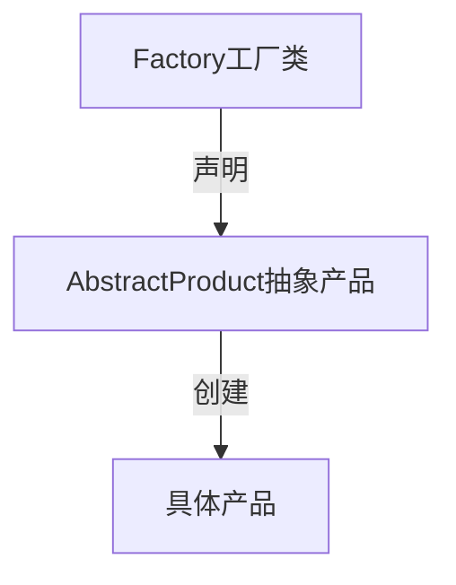

# 一、软件设计模式概述
## 1.1 软件设计模式的种类
GoF提出的设计模式有23个，包括：
1. 创建型(Creational)模式：如何创建对象；
2. 结构型(Structural )模式：如何实现类或对象的组合；
3. 行为型(Behavioral)模式：类或对象怎样交互以及怎样分配职责。

有一个“简单工厂模式”不属于GoF 23种设计模式，但大部分的设计模式书籍都会对它进行专门的介绍。
>设计模式目前种类： GoF的23种   + “简单工厂模式” = 24种。

## 1.2 如何学好设计模式
设计模式的基础是：多态。

初学者：积累案例，不要盲目的背类图。 

初级开发人员：多思考，多梳理，归纳总结，尊重事物的认知规律，注意临界点的突破，不要浮躁。

中级开发人员：合适的开发环境，寻找合适的设计模式来解决问题。

多应用，对经典则组合设计模式的大量，自由的运用。要不断的追求。

## 1.3 设计模式总览表
[设计模式总览表](https://www.yuque.com/aceld/lfhu8y/pebesh?inner=qSWMX)

# 二、面向对象设计原则
对于面向对象软件系统的设计而言，在支持可维护性的同时，提高系统的可复用性是一个至关重要的问题，如何同时提高一个软件系统的可维护性和可复用性是面向对象设计需要解决的核心问题之一。在面向对象设计中，可维护性的复用是以设计原则为基础的。每一个原则都蕴含一些面向对象设计的思想，可以从不同的角度提升一个软件结构的设计水平。 

面向对象设计原则为支持可维护性复用而诞生，这些原则蕴含在很多设计模式中，它们是从许多设计方案中总结出的指导性原则。面向对象设计原则也是我们用于评价一个设计模式的使用效果的重要指标之一。

>原则的目的：高内聚，低耦合

## 2.1 面向对象设计原则表

| 名称                                                | 定义 |
|---------------------------------------------------|---|
| 单一职责原则 (Single Responsibility Principle, SRP) |类的职责单一，对外只提供一种功能，而引起类变化的原因都应该只有一个。 |
| 开闭原则 (Open-Closed Principle, OCP)             |类的改动是通过增加代码进行的，而不是修改源代码。|
| 里氏代换原则 (Liskov Substitution Principle, LSP)   |任何抽象类（interface接口）出现的地方都可以用他的实现类进行替换，实际就是虚拟机制，语言级别实现面向对象功能。   |
| 依赖倒转原则 (Dependence  Inversion Principle, DIP) |依赖于抽象(接口)，不要依赖具体的实现(类)，也就是针对接口编程。   |
| 接口隔离原则 (Interface Segregation Principle, ISP) |不应该强迫用户的程序依赖他们不需要的接口方法。一个接口应该只提供一种对外功能，不应该把所有操作都封装到一个接口中去。   |
| 合成复用原则 (Composite Reuse Principle, CRP)       |如果使用继承，会导致父类的任何变换都可能影响到子类的行为。如果使用对象组合，就降低了这种依赖关系。对于继承和组合，优先使用组合。   |
| 迪米特法则 (Law of Demeter, LoD)                   |一个对象应当对其他对象尽可能少的了解，从而降低各个对象之间的耦合，提高系统的可维护性。例如在一个程序中，各个模块之间相互调用时，通常会提供一个统一的接口来实现。这样其他模块不需要了解另外一个模块的内部实现细节，这样当一个模块内部的实现发生改变时，不会影响其他模块的使用。（黑盒原理）   |

## 2.2 单一职责原则

类的职责单一，对外只提供一种功能，而引起类变化的原因都应该只有一个。

## 2.3 开闭原则

如果我们拥有接口, interface这个东西，那么我们就可以抽象一层出来.

>再看开闭原则定义:
>开闭原则:一个软件实体如类、模块和函数应该对扩展开放，对修改关闭。
>简单的说就是在修改需求的时候，应该尽量通过扩展来实现变化，而不是通过修改已有代码来实现变化。

## 3.1 简单工厂模式

- 工厂（Factory）角色：简单工厂模式的核心，它负责实现创建所有实例的内部逻辑。工厂类可以被外界直接调用，创建所需的产品对象。

- 抽象产品（Abstract Product）角色：简单工厂模式所创建的所有对象的父类，它负责描述所有实例所共有的公共接口。
- 具体产品（Concrete Product）角色：简单工厂模式所创建的具体实例对象。
  其标准的设计模式类图如下：

### 3.1.1 简单工厂模式优缺点
优点：
1. 实现了对象创建和使用的分离。
2. 不需要记住具体类名，记住参数即可，减少使用者记忆量。

缺点：
1. 对工厂类职责过重，一旦不能工作，系统受到影响。
2. 增加系统中类的个数，复杂度和理解度增加。
3. 违反“开闭原则”，添加新产品需要修改工厂逻辑，工厂越来越复杂。

### 3.1.2 适用场景
适用场景：
1. 工厂类负责创建的对象比较少，由于创建的对象较少，不会造成工厂方法中的业务逻辑太过复杂。
2. 客户端只知道传入工厂类的参数，对于如何创建对象并不关心。

## 3.2 工厂方法模式
### 3.2.1 工厂方法模式的优缺点
优点：
1. 不需要记住具体类名，甚至连具体参数都不用记忆。
2. 实现了对象创建和使用的分离。
3. 系统的可扩展性也就变得非常好，无需修改接口和原类。
   4.对于新产品的创建，符合开闭原则。

缺点：
1. 增加系统中类的个数，复杂度和理解度增加。
2. 增加了系统的抽象性和理解难度。

### 3.2.2 适用场景
1. 客户端不知道它所需要的对象的类。
2. 抽象工厂类通过其子类来指定创建哪个对象。

## 3.3 抽象工厂方法模式
### 3.3.1 抽象工厂方法的优缺点
1. 客户端不知道它所需要的对象的类。
2. 抽象工厂类通过其子类来指定创建哪个对象。

## 3.4 单例模式
### 3.4.1 单例模式的优缺点
优点：
1. 单例模式提供了对唯一实例的受控访问。 
2. 节约系统资源。由于在系统内存中只存在一个对象。

缺点：
1. 扩展略难。单例模式中没有抽象层。
2. 单例类的职责过重。
### 3.4.2 适用场景
1. 系统只需要一个实例对象，如系统要求提供一个唯一的序列号生成器或资源管理器，或者需要考虑资源消耗太大而只允许创建一个对象。 
2. 客户调用类的单个实例只允许使用一个公共访问点，除了该公共访问点，不能通过其他途径访问该实例。
